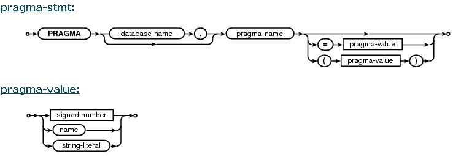

# pragma

 [原文地址](https://iihero.iteye.com/blog/1189633)
 
PRAGMA语句是SQLITE数据的SQL扩展，是它独有的特性，主要用于修改SQLITE库或者内数据查询的操作。它采用与SELECT、INSERT等语句一样的形式来发出请求，但也有几个重要的不同： 
1. 特定的PRAGMA语句可能被移走，新的PRAGMA语句可能在新的版本中添加。因此，后向兼容无法保证。 
2. 未知的PRAGMA命令不会有错误消息出现，它只是简单的忽略。 
3. 有些PRAGMA只在SQL的编译阶段起作用，而不是执行阶段。　这意味着如果使用C语言，sqlite3_prepare(), sqlite3_step(), sqlite3_finalize()这几个API，pragma命令可能只在prepare()的调用里运行，而不是在后两个API当中执行。或者，pragma可能在sqlite3_step()执行的时候运行。到底在哪个阶段执行，取决于pragma从本身，以及是哪个sqlite的release版本。 
4. pragma命令是sqlite特有的，基本上不可能与其它数据库保持兼容。 

PRAGMA命令的语法格式如下图： 

它可以不带参数，或者只带一个参数。这个参数可以是等号赋值，也可以用括号括起来。两者效果一样。很多情况下，参数值是布尔型，值为(1,yes,true 或on)或者(0, no, false, off) 

关键字参数，可以使用引号括起来，e.g. 'yes' [FALSE]。有些pragma命令会使用字符串作为参数，"0"和"no"表示相同的含义。当查询某设置的值时，很多情况下返回的是数值，而不是关键字。 

pragma名之前，可以选带数据库的名字。数据库名是被"attach"（关联）上的数据库名字，或者是"main", "temp"来表示主数据库和临时数据库。如果可选的数据库名被略去，则默认为"main"数据库。在有些pragma命令里，数据库名没有意义，则简单的忽略掉。 

下面我们看看sqlite到底有些有用的pragma命令： 

    auto_vacuum 
    automatic_index 
    cache_size 
    case_sensitive_like 
    checkpoint_fullfsync 
    collation_list 
    compile_options 
    count_changes1 
    database_list 
    default_cache_size1 
    empty_result_callbacks1 
    encoding 
    foreign_key_list 
    foreign_keys 
    freelist_count 
    full_column_names1 
    fullfsync 
    ignore_check_constraints 
    incremental_vacuum 
    index_info 
    index_list 
    integrity_check 
    journal_mode 
    journal_size_limit 
    legacy_file_format 
    locking_mode 
    max_page_count 
    page_count 
    page_size 
    parser_trace2 
    quick_check 
    read_uncommitted 
    recursive_triggers 
    reverse_unordered_selects 
    schema_version 
    secure_delete 
    short_column_names1 
    synchronous 
    table_info 
    temp_store 
    temp_store_directory1 
    user_version 
    vdbe_listing2 
    vdbe_trace2 
    wal_autocheckpoint 
    wal_checkpoint 
    writable_schema 
这里边有几个标了右上标为1的，似乎已经被obsoleted掉了。标为2的，只被用于debug,仅当sqlite在预编译宏SQLITE_DEBUG下build出来，才有用。 

下面看看这些命令的具体用法： 

## 1. PRAGMA auto_vacuum; 
  
    PRAGMA auto_vacuum = 0 或 NONE | 1 或 FULL | 2 或 INCREMENTAL; 

这里，0和NONE表示的含义相同。 

缺省值为0, 表示禁用auto vacuum. 

除非SQLITE_DEFAULT_AUTOVACUUM宏在编译的时候定义了。数据删除的时候，数据库大小不会改变。没用的数据库文件页面会被添加到freelist里头，用于将来重用。这时，使用VACUUM命令，可以重建整个数据库，以回收无用的磁盘空间。 

- 值为1时，所有的freelist页会被移动到文件末尾，每次事务提交的时候文件会被截短。注意，自动vacuum只是从文件是截断freelist页，并没有进行碎片重整等操作，也就是说，它没有VACUUM命令来得彻底。事实上，自动vacuum会让碎片更多。 

只有在数据库存储某些附加信息的时候，它允许每个数据库页来跟踪它的引用页，自动vacuum才用得上。它必须在没有创建任何表的情况下启用。在一个表已经创建了之后，是不能启用和停用auto-vacuum的。 

- 值为2时，表示增量vacuum，意味着并不是在每次提交事务的时候自动vacuum，需要调用一个独立的incremental_vacuum语句来触发auto-vacuum。 

 数据库可以在1和2两种vacuum模式下进行切换。但是不能从none到full或incremental间切换。要想切换，要么数据库是全新的数据库（没有任何表），　或者单独运行vacuum命令以后。改变自动vacuum模式，首先执行auto_vacuum语句设置新的模式，然后调用VACUUM来重整数据库。 

不带参数的auto_vacuum语句返回当前的auto_vacuum模式值。 

## 2. PRAGMA automatic_index; 

    PRAGMA automatic_index = boolean; 
   查询，设置或者清除自动索引的功能。缺省值为true (1). 

## 3. PRAGMA cache_size; 

    PRAGMA cache_size = <number of pages>; 
   
   查询或者修改打开的数据库内存里头能容纳的最多的数据库页数。缺省值是2000.　这样设定只会改变当前会话中的cache size，当数据库重新打开，又会恢复默认值。你可以使用default_cache_size来设定所有会话中的cache size 

## 4. PRAGMA case_sensitive_like=boolean; 
  
   默认行为是忽略ascii字符的大小写。'a' LIKE 'A'会是true. 当禁用case_sensitive_like时，会用默认的like行为。当启用它时，就会区分大小写。 

## 5. PRAGMA checkpoint_fullfsync 
    PRAGMA checkpoint_fullfsync=boolean; 

查询或设置fullfsync的标志值。如果设置了该值，则F_FULLFSYNC同步方法会在checkpoint操作时调用，默认值是off。只有Mac OS-X操作系统支持F_FULLFSYNC。另外，如果设定了fullfsync值，那么F_FULLFSYNC同步方法会在所有sync操作里使用，也checkpoint_fullfsync标志完全无关。 

## 6. PRAGMA collation_list; 
   
   返回当前数据库连接定义的所有排序顺序。 

## 7. PRAGMA compile_options; 

这个要赞，返回编译SQLITE时使用的所有预编译宏。当然，以"SQLITE_"打头的前缀会被忽略。实际上它是通过调用sqlite3_compileoption_get()方法返回的。 

## 8. PRAGMA count_changes; 

    PRAGMA count_changes=boolean; 
  
   该命令已经停用. 只是为了保持后向兼容. 如果不设置此值，INSERT, UPDATE, DELETE语句不会返回多少行改变的数据。 
   事实上，sqlite3_changes()可以获取改变的行数。 

## 9. PRAGMA database_list; 

 返回当前数据库连接关联的数据库列表. 

## 10. PRAGMA default_cache_size; 
    
    PRAGMA default_cache_size = Number-of-pages; 

设置缺省的cache sie, 是以页为单位。不幸的是，该命令也将被废弃。 

## 11. PRAGMA empty_result_callbacks; 
    
    PRAGMA empty_result_callbacks = boolean; 

 仅作后向兼容用。如果将该标志值清除，sqlite3_exec()提供的回调函数（返回0或多行数据）将不被触发。 

## 12. PRAGMA encoding; 
    
        PRAGMA encoding = "UTF-8"; 
        PRAGMA encoding = "UTF-16"; 
        PRAGMA encoding = "UTF-16le"; 
        PRAGMA encoding = "UTF-16be"; 

 缺省值是utf-8。如果使用attach命令，则会要求使用与main数据库相同的字符集编码，如果新的数据库编码与main不同，则会失败。 

## 13. PRAGMA foreign_key_list(table-name); 

返回外键列表 

## 14. PRAGMA foreign_keys; 
   
    PRAGMA foreign_keys = boolean; 

查询设置或者清除关于外键的限制, 外键限制只有在BEGIN或者SAVEPOINT不在PENDING状态时设置才有效。 

改变该设置会影响所有已经准备好的SQL语句的执行。 

从3.6.19开始，默认的FK强制限制是OFF。也就是说，不会强制外键依赖。 

## 15. PRAGMA freelist_count; 
    
    返回数据库文件中未使用页的数目 

## 16. PRAGMA full_column_names; 

    PRAGMA full_column_names = boolean; 
    deprecated. 
    
1. 如果有AS子句，列名就会用AS后的别名 
2. 如果结果只是普通的表达式，而不是源表的列名，则采用表达式的文本 
3. 如果使用了short_column_names开关为ON，则采用源表列名，并且不带表名前缀 
4. 如果两个开关都设为OFF，则采用第2个规则。 
5. 结果列是学有源表源列的组合：TABLE.COLUMN 

## 17. PRAGMA fullfsync; 

    PRAGMA fullfsync = boolean; 
    
缺省值为OFF，也只有MAC os支持F_FULLFSYNC 

## 18. PRAGMA ignore_check_constraints = boolean; 
 
    是否强制check约束，缺省值为off 

## 19. PRAGMA incremental_vacuum(N); 

N页从freelist中移除。用于设定此参数。每次截短相同的页数。该命令必须是在auto_vacuum=incremental模式下才有效。如果freelist中的页数少于N，或者N小于1，或者N被完全忽略，那么整个freelist会被清除。 

## 20. PRAGMA index_info(index-name); 
  
获取具名的index信息。 

## 21. PRAGMA index_list(table-name); 
   
获取与目标表关联的索引的的相关信息 

## 22. PRAGMA integrity_check; 
    
    PRAGMA integrity_check(integer); 
    
执行整个库的完全性检查，会查看错序的记录、丢失的页，毁坏的索引等。 

## 23. 
   
    PRAGMA journal_mode; 
    PRAGMA database.journal_mode; 
    PRAGMA journal_mode = DELETE | TRUNCATE | PERSIST | MEMORY | WAL | OFF 
    PRAGMA database.journal_mode = DELETE | TRUNCATE | PERSIST | MEMORY | WAL | OFF 

用于设置数据库的journal_mode. DELETE是缺省的行为。在此模式下，每次事务终止的时候，journal文件会被删除，它会导致事务提交。 

TRUNCATE模式，通过将回滚journal截短成0，而不是删除它。大多数情情况下，它要比DELETE模式速度快(因为不用删除文件） 

PERSIST模式，每次事务结束时，并不删除rollback journal，而只是在journal的头部填充0，这样会阻止别的数据库连接来rollback. 该模式在某些平台下，是一种优化，特别是删除或者truncate一个文件比覆盖文件的第一块代价高的时候。 

MEMORY模式，只将rollback日志存储到RAM中，节省了磁盘I/O，但带来的代价是稳定性和完整性上的损失。如果中间crash掉了，数据库有可能损坏。 
WAL模式，也就是write-ahead　log取代rollback journal。该模式是持久化的，跨多个数据为连接，在重新打开数据库以后，仍然有效。该模式只在3.7.0以后才有效。 
(经过实验，发现，它会生成两个文件：.shm和.wal) 

OFF模式，这样就没有事务支持了。　 

另外要注意的是，对于memory数据库，只有两种模式: 
MEMORY或者OFF。并且，当前如果有活跃的事务，则不允许改变事务模式。 

## 24. PRAGMA journal_size_limit 
    
    PRAGMA journal_size_limit = N ; 

如果连接时，用了"exclusive mode(PRAGMA locking_mode=exclusive)或者(PRAGMA journal_mode=persist), 提交事务以后，journal文件会仍然在文件系系统当中。这可能会提高了效率，但是也损耗了空间。一个大的事务（如VACUUM)，会耗费大量的磁盘空间。 

该设置会限制journal文件的大小。默认值是－1。 

## 25. PRAGMA legacy_file_format; 

    PRAGMA legacy_file_format = boolean; 

如果该值为ON，则会采用3.0.0文件格式，如果为off, 则会采用最新的文件格式，可能导致旧版本的sqlite无法打开该文件。 

第一次新文件格式的sqlite3数据库打开时，该值为off.但是默认值会是on. 

## 26. PRAGMA locking_mode; 
    
    PRAGMA locking_mode = NORMAL | EXCLUSIVE 

缺省值是NORMAL. 数据库连接在每一个读或写事务终点的时候放掉文件锁。如果是EXCLUSIVE模式，连接永远不会释放文件锁。在此模式下，第一次执行读操作时，会获取并持有共享锁，第一次写，会获取并持有排它锁。 

释放排它锁，仅当关闭数据库连接，或者将锁模式改回为NORMAL时，再次访问数据库文件（读或写）才会放掉。简单的设置为NORMAL是不够的，只有当下次再访问时才会释放排它锁。 

有下述三个理由，去设置锁模式为EXCLUSIVE 

1. 应用程序需要阻止其它进程访问数据库文件 
2. 文件系统的系统调用数量减少了，导致些许性能下降 
3. WAL日志模式可以在EXCLUSIVE模式下使用，而不需要用到共享内存 

当指定数据库名时，只能目标数据库生效。如： 
    
    PRAGMA main.locking_mode=EXCLUSIVE;  

不指定数据库名时，则对所有打开的数据库生效。temp或者memory数据库总是使用exclusive锁模式。 

第一次进入WAL日志模式时，锁模式使用的是exclusive，这以后，锁模式也不能改变，直到退出WAL日志模式，如果锁模式开始时使用的是NORMAL，第一次进入WAL，这时锁模式可以改变，并且不需要退出WAL模式。 

## 27. PRAGMA max_page_count; 
    
    PRAGMA max_page_count = N; 

查询或者设置数据库文件的最大页数 

## 28. PRAGMA page_count; 

返回数据库文件的页数 

## 29. PRAGMA page_size; 
   
    PRAGMA page_size = bytes; 

查询或者设置数据库文件的页大小, 必须是2的乘方，并且介于512和65536之间。 

创建数据库时，会给定一个缺省的大小。page_size命令会立即改变页大小（如果数据库是空的话，就是说在没有创建任何表的情况下）。如果指定了新大小，是在运行VACUUM命令之间，同时数据库不是在WAL日志模式下，那么VACUUM命令会将页大小调整到新的大小（这时应该没有是事创建表的限制） 
    SQLITE_DEFAULT_PAGE_SIZE 缺省值是1024，最大的缺省页大小是8192. windows下，有时候可能缺省页大小大于1024，取决于GetDiskFreeSpace()来获取真实的设置扇区大小。 

## 30. PRAGMA parser_trace = boolean; 

用在DEBUG的时候。 

## 31. PRAGMA quick_check; 

    PRAGMA quick_check(integer) 

与integrity_check相像，但是略去了对索引内容与表内容匹配的校验。 

## 32. PRAGMA read_uncommitted; 
    
    PRAGMA read_uncommitted = boolean; 

读未提交开关。缺省的事务隔离级是：可串行化。任何进程或线程都可以设置读未提交隔离级，但是，SERIALIZABLE仍被使用，除了共享某页和表模式的缓存的那些连接。 

## 33. PRAGMA recursive_triggers; 
    
    PRAGMA recursive_triggers = boolean; 

会影响所有的语句执行。3.6.18以前，这个开关是不支持的。缺省值是off. 

## 34. PRAGMA reverse_unordered_selects; 
    
    PRAGMA reverse_unordered_selects = boolean; 

当开启此开关时，不带order by的select语句，会输出相反顺序的结果。 

## 35. PRAGMA schema_version; 

    PRAGMA schema_version = integer ; 
    PRAGMA user_version; 
    PRAGMA user_version = integer ; 

schema和user version是在数据库文件头40，60字节处的32位整数（大端表示）。 

schema版本由sqlite内部维护，当schema改变时，就会增加该值。显式改变该值非常危险。 

user版本可以被应用程序使用。 

## 36. PRAGMA secure_delete; 
    
    PRAGMA database.secure_delete; 
    PRAGMA secure_delete = boolean 
    PRAGMA database.secure_delete = boolean 

设为ON时，删除的内容会用0来覆盖。缺省值由宏SQLITE_SECURE_DELETE 决定。那就是OFF了。 

## 37. PRAGMA short_column_names; 

    PRAGMA short_column_names = boolean; 
    deprecated. 

## 38. PRAGMA synchronous; 
    
    PRAGMA synchronous = 0 | OFF | 1 | NORMAL | 2 | FULL; 

查询设置sync标志值。缺省值是FULL. 

## 39. PRAGMA table_info(table-name); 

返回表的基本信息 

## 40. PRAGMA temp_store; 
    
    PRAGMA temp_store = 0 | DEFAULT | 1 | FILE | 2 | MEMORY; 

    查询或设置temp_store参数值。 

<table>
<tr>
	<td>SQLITE_TEMP_STORE</td>
	<td>PRAGMA temp_store</td>
	<td>Storage used forTEMP tables</td>
</tr>
<tr>
	<td>0</td>
	<td>any</td>
	<td>file </td>
</tr>
<tr>
	<td>1</td>
	<td>0</td>
	<td>file </td>
</tr>
<tr>
	<td>1</td>
	<td>1</td>
	<td>file </td>
</tr>
<tr>
	<td>1</td>
	<td>2</td>
	<td>memory </td>
</tr>
<tr>
	<td>2</td>
	<td>0</td>
	<td>memory </td>
</tr>
<tr>
	<td>2</td>
	<td>1</td>
	<td>file </td>
</tr>
<tr>
	<td>2</td>
	<td>2</td>
	<td>memory </td>
</tr>
<tr>
	<td>3</td>
	<td>any</td>
	<td>memory </td>
</tr>
</table>

## 40. PRAGMA temp_store_directory; 
    
    PRAGMA temp_store_directory = 'directory-name'; 

设置或改变temp_store的目录位置. deprecated. 

## 41. PRAGMA vdbe_listing = boolean; 
    
用于DEBUG 

## 42. PRAGMA vdbe_trace = boolean; 

用于DEBUG 

## 43. PRAGMA wal_autocheckpoint; 
    
    PRAGMA wal_autocheckpoint=N; 

设置WAL自动检查点的间隔（以页为单位）, 缺省值是1000。 

## 44. PRAGMA database.wal_checkpoint; 
    
    PRAGMA database.wal_checkpoint(PASSIVE); 
    PRAGMA database.wal_checkpoint(FULL); 
    PRAGMA database.wal_checkpoint(RESTART); 

## 45. PRAGMA writable_schema = boolean; 

当设为ON时，SQLITE_MASTER表可以执行CUD操作。这样做很危险!! 