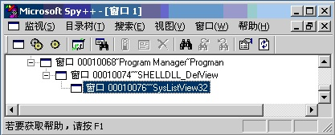

# Windows Shell是什么

 [原文地址](http://blog.csdn.net/chchzh/article/details/2211475)

**第一章 Windows Shell是什么**

一个操作系统外壳的不错的定义是它是一个系统提供的用户界面，它允许用户执行公共的任务，如访问文件系统，导出执行程序，改变系统设置等。MS-DOS有一个Command.COM扮演着这个角色。然而Windows已经有了图形界面环境，他的外壳程序也就必然是图形方式的。在Windows95以前，默认的Windows Shell就是程序管理器。

程序管理器是一个中央控制台，从那里你可以启动应用程序，重排和重组图标，执行新任务。换句话说，程序管理器就像他的名字提示的那样管理所有集中在Windows大伞之下的程序。现在对应程序管理器的是文件管理器，它是一个专门为维护文件系统而设计的工具。

随着Windows95的出现，探测器取代了这两个老工具，并集成了二者的功能，如果你愿意，你仍能发现文件管理器仍然深深地隐藏在Windows系统目录中。然而，由于用户友善性方面比他的后继者差，现今已经很少使用了。

一般错误的概念认为，探测器就是一个程序，当你需要通过点击“我的计算机”或右击“开始”按钮来浏览文件系统时这个程序启动。事实上，探测器总是启动和运行着的，从引导开始一直到你关闭计算机。直觉是“探测器”实际上就是新概念下的窗口。探测器是一个可执行模块（explorer.exe），它实现了Windows外壳功能。

在这一章中，主要是介绍外壳和探测器，更精确地讲是

>* Shell的组成部分
>* 探测器结构

Shell的组成部分
----------

Shell由许多不同的部分组成，现在我们就从最显而易见的桌面和任务条开始。从概念上讲，桌面是所有Windows Shell对象的父对象，即宿主对象。就实现方式而言，桌面是一个系统定义窗口类的特殊窗口（命名为#32769），并且是所有窗口的祖先窗口。那些导出应用的顶层窗口一般而言都是桌面的子窗口。在这些子窗口中有一个有趣的窗口子树，它的根是“程序管理器”。

你可以用CV++带的工具Spy++来检查窗口栈中打开的窗口。

程序管理器保持了兼容性，在图中你可以看到，他的封装结构：程序管理器的直接下级是一个命为SHELLDLL DefView的窗口类，这个窗口包含了一个默认的观察对象，事实上这个窗口负责枚举标准文件夹的内容，它总是从ListView控件中导出，这是一个通用的系统控件。SHELLDLL DefView窗口包含了一个ListView(类名为SysListView32)和一个标题控件(类名为SysHeader32)，标题控件仅仅用于ListView的报告观察。

随着IE4.0的活动桌面和Windows98的发布，默认的观察对象已经有了基于某些浏览器能力的变化。在下一章中我们将更进一步讨论这些观察对象和他们的变化。

程序管理器
-----

就象前面提到的一样，程序管理器窗口是为了兼容性而保留的。它正好演示了一个窗口应用从16位到32位的演变过程。在Win16环境中，与Shell唯一的通讯方式是通过动态数据交换（DDE）。这个层面的代码在Windows95 甚至Windows98 中还在维护。为什么呢？，为了兼容性。

关于DDE接口变成与Shell的详细说明，建议察看资料Internet ClientSDK其中给出了最新的信息。DDE是一款较老的技术，微软已经有大量的资料说明。

任务条
---

主要的Windows Shell部件就是任务条，它实际上就是由探测器进程所拥有的一个窗口。每当你需要终止探测器进程的时候，都将引起任务条的消失和重新显现。每当他重新显现的时候他注册一个具有不同HWND的新窗口。因而，就引用而言，你没有必要保留这个窗口的HWND 。任务条也是也各拥有“开始”按钮的窗口，在托盘区域有时钟和类似按钮的控件，表示正在运行的应用。

任务条实际上与窗口一样，可以在其上作任何窗口上可以做的操作如移动、隐藏和子类化等。在第七章中我们将说明怎样子类化任务条和“开始”按钮。在第九章中可以找到怎样隐藏任务条和编成重新启动Shell。这后一个特性在编成实现Shell和命名空间扩展时是有用的。

桌面
--

你是否奇怪，桌面上的快捷方式是从哪里来的和属于谁，坦白地讲，开始我也认为探测器模块绘制了这些图标，记录了用户设置，颜色，状态等。这个模块开可能在桌面背景上绘制用户设置的墙纸。

桌面并不是这样工作的，相反，快捷方式作为图标是由一个普通的ListView显示的。当然这个ListView有了一个不寻常的变异，但是它确实是一个ListView，因此它也就不难从消息中获取处理对象了，将在第九章中给出例程进行说明。

探测器结构
-----

探测器是一个扮演着系统外壳角色的应用程序。当说到外壳扩展的时候，我们讲的就是有探测器感知的、装入的并最终执行的代码块。

探测器可以被看作为一个微型的窗口开发环境。想象一下：它有自己的函数和对话框；允许写特殊的与已存在的体系集成的应用程序；能包容应用和文档。他甚至可以解释任何活动的脚本兼容语言的脚本（VBScript，JScript，Perl，等等）。本书中将包含所有这些特征。

扩展的切入点
------

随Windows3.1一起发布的文件管理器有着非常好的旦未充分利用的特性，比如：它能够在运行时加载DLL，执行具有特殊原形的已注册函数等。也就是说，在这个资源中有一点，其代码本身能够知晓某些活动是由用户执行的。换句话说，文件管理器支持扩展行为，当执行特定的活动时，查找注册的扩展并装载和运行之。

我们后面在探测器外壳和命名空间扩展中见到的实际上有相同的原理。不同的完全是细节方面的实现。文件管理器用于加载具有预定义原形的传统的DLL全程函数，而探测器是这一过程更加规范。尤其是它采用COM接口(可以看作预定义和固定函数原型的集合)和进程内服务器(实质上的DLL)

*当然，COM接口和进程内服务器比函数集和DLL更复杂，但是，这也使探测器进程比老的基于DLL的进程更规范和有力。*

对探测器的扩展
-------

在探测器环境中，基本上有两种类型的扩展：外壳扩展和命名空间扩展。从名字上看有点混淆，探测器就是Windows的外壳，所以两种类型的扩展都可以作为外壳扩展。换句话说，外壳和命名空间扩展二者都扩展了探测器能力。但是在他们之间有一些差别。

外壳扩展是一种加到给定类型的所有文件上的客户行为，给定类型的文件按照客户要求显示在探测器的观察中。如此，你可以称之为“外壳观察的扩展”。客户的行为，如拖拽，右击关联菜单，绘制图标或显示属性对话框等由一定数量的特殊事件触发。你可以定义这些事件的特殊处理器程序，例如你可以确定显示给定.jpg文件的图标，为所有Windows 元文件加一个预览页面到属性对话框，甚至可以在关联菜单中增加一个可执行功能。将在十五章中给出例程。

命名空间扩展有两种形式，这要看你怎样连接。如果你用文件类型连接命名空间扩展，尽管有复杂的代码支持，其功能上仍然等价于关联菜单的扩展。然而，如果你用文件夹连接命名空间扩展，这个文件夹将变成客户文件夹，你的代码将确定文件夹的内容、探测器显示的图标、子文件夹、排序、关联菜单等。

为什么要对Shell编程
------------

这个问题很有道理，简单的回答就是，为了使我们的应用根号和更丰满。但是这个回答有点过于辞令化，我们这样做是为了使我们的模块与系统集成到一起，或者说更自动化。

本书的结构
-----

有两种方法对外壳编程，使用API函数和使用COM接口。这两种方法既不互相独立也不相互重叠，它们是两个不同的方向和两种不同领域，这一点我们在下一章中将进一步阐述。现在让我们直接浏览一下个章节的内容。

你知道Shell编程要求使用API函数和COM接口，API函数使你能够访问Shell的基本功能，如，文件操作，浏览文件夹，执行程序，处理图标和快捷方式等。当你想要增强和精炼Shell的基本行为时，COM方法则触及到了客户化Shell扩展的核心。

这本书中首先给出所有API函数的解释，进一步探讨函数的原型，资料介绍的差别以及其中的Bugs。通常我的目的是要澄清所有你在资料中遇到的含混之处。第三章到第九章涉及到特殊的APIs分组，其中包含了典型的Shell操作，特别在第三章中讲解SHFileOperation()函数，涉及到文件的拷贝、移动、删除和重命名操作。第四章揭示了神秘的SHGetFileInfo()函数，系统提供了获取文件(属性、图标、类型和显示名)的系统信息和Shell信息的方法。第五章解释文件夹内部组织的叠放过程，包括设置、浏览和象Favorites和SendTo那样的特殊文件夹。

快捷方式和属性在第六章中介绍，其中将介绍建立和解析快捷方式和经常使用的字段。第七章则正式进入探测器地址空间，并且从另一个角度讨论客户化问题：在探测器不可知的情况下什么是你所能安全操作的。特别是我们向你展示一个置换过的“开始”按钮和不同的菜单。一旦你这样做过之后，你就有了完全控制Windows系统的能力了。在余下的第八和第九章中我们将讲述程序的扩张，图标和任务条，我们将说明怎样编程加入新的具有自己的菜单的按钮到任务条中。

这本书的第二部分是基于要求COM接口的探测器特征的。但是直到第十二章之前我们还没有涉及到接口知识，中间的两章作为Shell函数和探测器接口的桥梁。第十章包含了最近更新的Windows的SDK函数。第十一章给出了Shell对象的概览，例如“我的公文包”，“控制面板”和“打印机”，以及客户文件夹的概念。在这一章中还包括了其他Shell对象和RunDLL32使用程序的说明以及全部探测器命令行的解释。

第十二章介绍Shell对象模型，首先致力于把API函数的一个子集移动到对应的COM接口中去，这个特性最少要求系统中要安装“活动桌面”。有趣的是这个对象模型允许你访问系统的某些功能（绝大多数系统对话框）。

第十三章介绍Windows脚本环境，这是一个执行Windows批处理文件的运行时引擎。技术上讲，这并不是一个Shell实体，但是它与Shell有重要的留级关系。Windows脚本环境显露一个对象模型，使你能够使用VBScript，Jscript等任何脚本语言编写程序。我将通过加入有用的新对象来扩展这个模型。

第十四章集中于指导你采用Shell和命名空间扩展的应用和理由方面。我将揭示实际上的Shell集成的应用究竟是什么和为什么说Shell扩展是把应用模块与系统Shell融合的最好方法。第十五章说明怎样写一个Shell扩展来客户化关联菜单、图标和属性，以及怎样排错。第十六章概括了命名空间扩展内容，并且包含一个例子，说明怎样加一个可展开节点到探测器的树观察中，并以文件夹的形式展示了当前窗口的堆栈过程。

小结
--

这一章中我们描绘了未来各章中打算作的事情，尤其是我们试图解释：

> * Shell的本质和结构
> * 各Shell版本之间的差异

## links
   * [目录](<00-dir.md>)
   * 上一节: [序言](<00-序言.md>)
   * 下一节: [Shell的结构](<02-Shell的结构.md>)