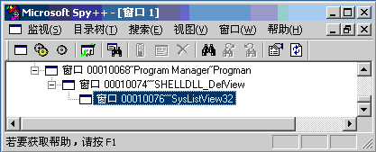

# 02-Windows Shell是什么

 [原文地址](http://blog.csdn.net/chchzh/article/details/2211475)

**第一章 Windows Shell是什么**

一个操作系统外壳的不错的定义是它是一个系统提供的用户界面，它允许用户执行公共的任务，如访问文件系统，导出执行程序，改变系统设置等。MS-DOS有一个Command.COM扮演着这个角色。然而Windows已经有了图形界面环境，他的外壳程序也就必然是图形方式的。在Windows95以前，默认的Windows Shell就是程序管理器。

程序管理器是一个中央控制台，从那里你可以启动应用程序，重排和重组图标，执行新任务。换句话说，程序管理器就像他的名字提示的那样管理所有集中在Windows大伞之下的程序。现在对应程序管理器的是文件管理器，它是一个专门为维护文件系统而设计的工具。

随着Windows95的出现，探测器取代了这两个老工具，并集成了二者的功能，如果你愿意，你仍能发现文件管理器仍然深深地隐藏在Windows系统目录中。然而，由于用户友善性方面比他的后继者差，现今已经很少使用了。

一般错误的概念认为，探测器就是一个程序，当你需要通过点击“我的计算机”或右击“开始”按钮来浏览文件系统时这个程序启动。事实上，探测器总是启动和运行着的，从引导开始一直到你关闭计算机。直觉是“探测器”实际上就是新概念下的窗口。探测器是一个可执行模块（explorer.exe），它实现了Windows外壳功能。

在这一章中，主要是介绍外壳和探测器，更精确地讲是

>* Shell的组成部分
>* 探测器结构

Shell的组成部分
----------

Shell由许多不同的部分组成，现在我们就从最显而易见的桌面和任务条开始。从概念上讲，桌面是所有Windows Shell对象的父对象，即宿主对象。就实现方式而言，桌面是一个系统定义窗口类的特殊窗口（命名为#32769），并且是所有窗口的祖先窗口。那些导出应用的顶层窗口一般而言都是桌面的子窗口。在这些子窗口中有一个有趣的窗口子树，它的根是“程序管理器”。

