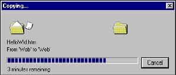
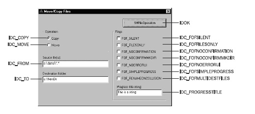
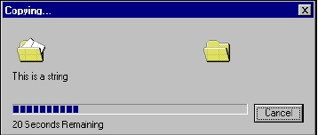
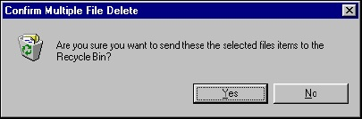

# 操作文件

 [原文地址](https://blog.csdn.net/chchzh/article/details/2233634)

我依然清楚地记得，Windows95 的贝塔版出现的情形，它在朋友之间和学院中传播，好酷，全新的文件管理器，一种全图标，全彩色可客户化的界面，以及活泼的动画标识使得在文件拷贝和删除方面的操作更容易和直观。

作为真正的软件狂人，我们能为一个比萨饼的奖金开始竞赛，一直以求成为第一个能够编程再造如此行为的人—即，怎样以动画方式拷贝文件。花了几个小时的时间才在一大堆新函数中找出了SHFileOperation()函数，这是一个响应动画拷贝的API函数，它也是探测器执行所有文件操作的函数。

竞赛的规则之一是建立一个具有这个唯一目标功能的演示程序。在这个函数出现之后，这个问题实际上是十分简单的。事实上，当我确定在程序中使用这个函数作为标准函数来进行文件操作时，问题就出现了。要这样做，你就必须彻底弄清楚这个函数的原型和它的能力，实际有趣的故事从这里就开始了。

在这一章中，我打算向你展示SHFileOperation()的内部奥秘。

- 怎样正确地使用函数所支持的标志和命令
- 怎样正确使用源/目缓冲区
- 最有可能的返回码是什么
- 对于长文件名，可能遇到的问题
- 关于文件名映射，以前未暴露的问题

与这本书的其它任何地方一样，在这一章中，你将发现一些有帮助的函数，它们推动你使用Windows的通用控件，对话框。

## SHFileOperation()能做些什么

 要得到这个问题的答案，先让我们先来看一下在文件shellapi.h中SHFileOperation()函数的声明：

    int WINAPI SHFileOperation(LPSHFILEOPSTRUCT lpFileOp);

进一步，看一看SHFILEOPSTRUCT结构，这也是一个在shellapi.h中定义的结构。

    typedef struct _SHFILEOPSTRUCT
    {
        HWND hwnd;
        UINT wFunc;
        LPCSTR pFrom;
        LPCSTR pTo;
        FILEOP_FLAGS fFlags;
        BOOL fAnyOperationsAborted;
        LPVOID hNameMappings;
        LPCSTR lpszProgressTitle;
    } SHFILEOPSTRUCT, FAR* LPSHFILEOPSTRUCT;

通过这个结构，SHFileOperation()函数可以做任何想要做的操作。简要地说，这个函数可以做：

- 把一个或多个文件从源路径拷贝到目路经
- 删除一个或多个文件，把它们发送到‘回收站’
- 重命名文件
- 把一个或多个文件从源路径移动到目路径

到目前为止，我们没有看到任何新东西—至少没有特别刺激的东西。事实上，Win32 API(和C运行库)已经提供了做同样事情的方法。特别是Win32 API提供了 CopyFile(), DeleteFile(), 和MoveFile()来执行这些任务。

然而，强大的SHFileOperation()函数的出现，使你能够仅仅使用一个命令就可以处理对缺省目录的多重拷贝和建立。他还支持‘Undo’操作，以及在目标名冲突的情况下自动重命名操作。最后，他还大方地提供了一个空白纸页一个从文件夹漂动到另一个文件夹显示的动画。

毋庸置疑，你可以从Win32的底层APIs获得同样的功能，但是这可能需要做大量的工作。

## SHFileOperation()函数怎样工作

 与所有仅使用数据结构作为输入参数的函数一样，SHFileOperation()函数是一个相当灵活的例程。通过以适当的方式组合各种标志，和使用(或不使用)各个SHFILEOPSTRUCT结构的成员，它可以执行许多操作。 下面就让我们来看一看这个结构中每一个成员所起的的作用：

<table>
<tr>
	<td>名</td>
	<td>描述</td>
</tr>
<tr>
	<td>Hwnd</td>
	<td>由这个函数生成的所有对话框的父窗口Handle。</td>
</tr>
<tr>
	<td>wFunc</td>
	<td>表示要执行的操作</td>
</tr>
<tr>
	<td>pFrom</td>
	<td>含有源文件名的缓冲</td>
</tr>
<tr>
	<td>pTo</td>
	<td>含有目标文件名的缓冲(不考虑删除的情况)</td>
</tr>
<tr>
	<td>fFlags</td>
	<td>能够影响操作的标志</td>
</tr>
<tr>
	<td>fAnyOperationsAborted</td>
	<td>包含TRUE或FALSE的返回值。它依赖于是否在操作完成之前用户取消了操作。通过检测这个成员，你就可以确定操作是正常完成了还是被手动中断了。</td>
</tr>
<tr>
	<td>hNameMappings</td>
	<td>资料描述它为包含SHNAMEMAPPING结构数组的文件名映射对象的Handle。</td>
</tr>
<tr>
	<td>lpszProgressTitle</td>
	<td>一个在一定情况下用于显示对话框标题的字符串。</td>
</tr>
</table>

简言之，有四个成员确实需要进一步研究，它们是：

- wFunc (间接地包括pFrom和pTo)
- fFlags
- hNameMappings
- lpszProgressTitle

可用的操作

 wFunc成员指定了在给定文件上操作，这些文件由pFrom和pTo给出。wFunc的可能取值(在shellapi.h定义)是：

<table>
<tr>
	<td>代码</td>
	<td>值</td>
	<td>描述</td>
</tr>
<tr>
	<td>FO_MOVE</td>
	<td>0x0001</td>
	<td>所有在pFrom中指定的文件都被移动到pTo指定的位置，pTo必须是一个目录名。</td>
</tr>
<tr>
	<td>FO_COPY</td>
	<td>0x0002</td>
	<td>所有在pFrom中指定的文件都被拷贝到pTo指定的位置，其内容可以是目录名或甚至是一个与pFrom 1：1对应的文件集。</td>
</tr>
<tr>
	<td>FO_DELETE</td>
	<td>0x0003</td>
	<td>所有在pFrom中指定的文件都被发送到‘回收站’，pTo被忽略。</td>
</tr>
<tr>
	<td>FO_RENAME</td>
	<td>0x0004</td>
	<td>所有在pFrom中指定的文件都重新命名为pTo中指定的名字，在pFrom和pTo之间，名字不需1：1对应。</td>
</tr>
</table>

pFrom和pTo都是包含一个或多个文件名的缓冲。如果包含了多于一个的文件名，则各个文件名之间就需要用NULL(字符/0)进行分隔,并且整个串需要用两个NULL(/0/0)字符结束，无论有多少文件名。

如果pFrom和pTo不包含目录信息(即，它们不是全路径名)，则，函数假设它应该使用由GetCurrentDirectory()函数返回的驱动器和目录。pFrom可以包含通配符，也可以是“*.*”这样的字符串。

 设置SHFILEOPSTRUCT结构的fFlags成员标志能够影响所有这些操作。在线资料中按字符顺序列出了所有标志。在我们的简短讨论中，将采取稍微不同的方法，将标志根据它能影响的实际操作分组，如果你想要自然排列的表，请引用在线资料。

## 注意两个空的结尾符(/0/0)

 其实，就pFrom和pTo是指向一个字符串列表的指针而不是通常意义的缓冲这样一个事实而言，资料的说明并不充分。也就是说，SHFileOperation()总是期望传送来的串由两个NULL字符终止，即使你传送的只有单个文件名或使用通配符的单个串也是如此。如果不使用两个NULL字符来终止pFrom和PTo中的字符串，则可能的情况就是函数在分析传来的内容时失败。此时，它返回一个‘不能拷贝/移动文件’错(错误码 1026)。没有两个NULL字符，函数可能会把字符串尾，单个NULL字符后的字节作为被拷贝或移动的文件名。这些字节可以是任何东西，可能不是合法的文件名，因此错误就出现了。由于pFrom总是被解释为文件名列表，而pTo只有在FOF_MULTIDESTFILES标志下才被解释为文件名列表，所以这个错误常常伴随pFrom一同出现。在所有其它情况，SHFileOperation()都假设pTo引用单个文件名。因此单个NULL字符终止是充分的—两个NULL终止仅仅在终止包含多个文件名的列表时被要求。除非明确说明有多个目标文件，对pTo内容的解析停止于头一个NULL终止符。

解析方法依赖于指针是否引用了字符串列表或简单缓冲，为安全起见，你应该总附加一个终止符到你打算赋值给pFrom的字符串后面，同样，对pTo，如果有多个目的文件的话，也是如此。字面上，你可以显式加一个/0在串的结尾(当然，字符串自动终止在单个NULL字符上)：

    shfo.pFrom = "c://demo//one.txt/0c://demo//two.txt/0";

如果使用变量，可以采用下面的方法：

    pszFrom[lstrlen(pszFrom) + 1] = 0;

## 移动和拷贝文件

 要把文件从一个位置移动或拷贝到另一个位置，需要指定：

- 包含源文件名的缓冲。可以是一个名字序列，单个名字，一个包含通配符的串，甚至可以是含通配符的串序列。
- 一个目的目录。如果你移动一个确定的文件列表，还要准备一个目标名列表，注意保证1：1的与源名对应。换句话说，每一个源文件名都必须有一个目标文件名以便移动或拷贝。如果有多个目标文件，就必须在fFlags中指定FOF_MULTIDESTFILES标志。

这个标志可以影响的操作是：

<table>
<tr>
	<td>标志</td>
	<td>值</td>
	<td>描述</td>
</tr>
<tr>
	<td>FOF_MULTIDESTFILES</td>
	<td>0x0001</td>
	<td>pTo成员包含多个与源文件对应的目标文件。</td>
</tr>
<tr>
	<td>FOF_SILENT</td>
	<td>0x0004</td>
	<td>发生的操作不需要返回到用户，就是说，不显示进度条对话框，而其它相关的消息框仍然显示。</td>
</tr>
<tr>
	<td>FOF_RENAMEONCOLLISION</td>
	<td>0x0008</td>
	<td>如果目标位置已经包含了与打算移动或拷贝的文件重名的文件，这个标志指示要自动地改变目标文件。</td>
</tr>
<tr>
	<td>FOF_NOCONFIRMATION</td>
	<td>0x0010</td>
	<td>这个标志使函数对任何消息框的回答总是Yes，只有一个例外，就是当询问是否建立缺省目录的对话框显示时。此时，需要FOF_NOCONFIRMMKDIR标志帮忙。(参考后面的说明)。</td>
</tr>
<tr>
	<td>FOF_FILESONLY</td>
	<td>0x0080</td>
	<td>这个标志仅仅应用于指定了包含子目录和通配符(*.*)的情况。设置了这个标志，函数仅仅处理文件而不进入到子目录。</td>
</tr>
<tr>
	<td>FOF_SIMPLEPROGRESS</td>
	<td>0x0100</td>
	<td>这个标志产生一个简化的用户界面：有一个动画窗口，但是不显示文件名，而是显示通过lpszProgressTitle 成员指定的文字。</td>
</tr>
<tr>
	<td>FOF_NOCONFIRMMKDIR</td>
	<td>0x0200</td>
	<td>如果目标目录不存在，这个标志使函数默默地建立一个缺省目录。没有这个标志，函数将提示是否建立一个完整的目的路径。这个标志与下一个将要介绍的标志有点微妙的关系。</td>
</tr>
<tr>
	<td>FOF_NOERRORUI</td>
	<td>0x0400</td>
	<td>如果设置了这个标志，发生的任何错误都不会引起消息框的显示，全部都返回错误码。这个标志与上一个标志关系有点微妙。</td>
</tr>
<tr>
	<td>FOF_NOCOPYSECURITYATTRIBS  </td>
	<td>0x0800</td>
	<td>应用于WindowsNT，Shell4.71(WindowsNT具有IE4.0 和活动桌面)，和更高版本。这个标志防止对具有安全属性的文件进行拷贝。</td>
</tr>
</table>

现在让给我们更详细地了解一下这些选择，在移动或拷贝文件的时候，所关心的有两个主要方面：正确地标识要传送的文件，和确保所设置的标志产生所希望的行为。

## 避免不想要的对话框

如果你希望操作默默地进行，不需要显示对话框或系统错误消息，你可能认为FOF_NOERRORUI | FOF_SILENT标志的组合是一个好的选择。然而，这并不是真的，正象我所提到的，使用FOF_NOERRORUI仅仅能隐藏错误引发的消息框。另一方面，FOF_SILENT标志自己不能防止这个函数显示所有可能的消息框。事实上，FOF_SILENT仅仅影响到进度条对话框—即，显示被拷贝或移动的文件名，伴随一个通常的动画对话框。如果函数发现给定的文件或目录在目标位置已经存在，它将总是显示提示。要避免这个行为，你就需要把FOF_NOCONFIRMATION设置加到标志中。这将使函数在每一步都采用一个不可见的Yes点击行为。然而这个故事远没有结束。

 如果目标路径包含了缺省目录，所有这些标志都无效。在继续执行文件的拷贝或移动之前，这个函数试图保证目标目录的存在，你可能已经合理地指定了一个不存在的目录，这个函数将小心地建立它，但是，它首先要求一个显式的认可。

要跳过这个对话框，需要设置标志FOF_NOCONFIRMMKDIR。如果设置了这个位，函数就自动建立任何缺省的目录而不显示提示框。

 概括地说，如果想完成拷贝（或移动）操作而不需要用户的干涉，你可以使用如下的标志组合设置SHFILEOPSTRUCT 结构的fFlags成员：

    FOF_SILENT
    FOF_NOCONFIRMATION
    FOF_NOERRORUI
    FOF_NOCONFIRMMKDIR

然而，关于同时使用FOF_NOERRORUI和FOF_NOCONFIRMMKDIR标志组合，仍然有一点是需要澄清的。

## 缺省目录

 有趣的是，一个缺省目录可以看作是一个由系统对话框弹出的系统错。尽管你可以通过设置FOF_NOCONFIRMMKDIR标志跳过这个对话框，但是FOF_NOERRORUI标志优先于FOF_NOCONFIMMKDIR，有效地抑制了对话框，使后面所涉及到它的标志不被选择。如果这两个标志都被指定，你既不能被提示授权建立不存在的目录，也不能自动建立目录，相反，这个函数继续执行就象拒绝建立目录一样，并将返回：

- 错误码117
- 取消标志fAnyOperationsAborted设置到True
- 不产生文件的移动或拷贝

这是否是说，要避免使用FOF_NOERRORUI标志呢？当然，如果你想要绝对静默的操作，就不可避免地要使用它—以防止所有错误消息框显示。问题是它也阻止了新目录默认地建立，并且产生一个无谓而又麻烦的错误。幸运地是，有一种方法能够绕过它，即，在使用这个标志调用SHFileOperation()前，确保pTo中存储的是已存在的全路径名。Win32提供了一个实现这个目的的函数：

    BOOL MakeSureDirectoryPathExists(LPCSTR DirPath);

使用这个函数需要 #include imagehlp.h 文件，和连接imagehlp.lib库。

## 文件重命名

 SHFileOperation()函数在置换已存在文件时能够引起的问题之一是：

或类似地，它引起的已存在目录的问题：

通过设置FOF_NOCONFIRMATION，可以隐含地允许函数置换老对象，但是第二种可能出现了。你知道，如果在Windows探测器中选择文件，并按Ctrl-C键，然后按Ctrl-V键，在同一个文件夹下将出现一个新文件，这个文件具有同拷贝Xxxx相似的文件名，此处Xxxx就是你选择的文件。探测器自动重命名了这个新文件以避免冲突。只要设置了FOF_RENAMEONCOLLISION标志，SHFileOperation()函数也能提供这个功能。FOF_RENAMEONCOLLISION和FOF_NOCONFIRMATION标志组合禁止了置换操作时的确认对话框。然而接下来，你的文件或目录将不可避免地被覆盖。如果不合理的情况下指定这两个标志，则FOF_RENAMEONCOLLISION标志优先

##　标志间的关系

 到目前为止，在你的脑海中应该有两个问题，一是各个标志之间究竟是什么样的关系，其次是哪些标志影响哪类对话框。下表给出了问题的答案。

<table>
<tr>
	<td>标志</td>
	<td>抑制的对话框</td>
	<td>相关性与优先级</td>
</tr>
<tr>
	<td>FOF_MULTIDESTFILES</td>
	<td>None</td>
	<td>None</td>
</tr>
<tr>
	<td>FOF_FILESONLY</td>
	<td>None</td>
	<td>None</td>
</tr>
<tr>
	<td>FOF_SILENT</td>
	<td>如果设置，进度对话框不显示。</td>
	<td>优先于FOF_SIMPLEPROGRESS标志。</td>
</tr>
<tr>
	<td>FOF_SIMPLEPROGRESS</td>
	<td>None</td>
	<td>为FOF_SILENT标志所抑制。</td>
</tr>
<tr>
	<td>FOF_RENAMEONCOLLISION</td>
	<td>如果设置了这个标志，当被移动或拷贝的文件与已存在文件同名时置换对话框不会出现。</td>
	<td>名字冲突时，如果FOF_NOCONFIRMATION标志设置，则操作继续。 如果二者都设置了，则它优先于FOF_NOCONFIRMATION。即，文件以给定的新名字复制，而不是覆盖。</td>
</tr>
<tr>
	<td>FOF_NOCONFIRMATION</td>
	<td>如果设置，确认对话框在任何情况下都不出现。</td>
	<td>名字冲突时，引起文件覆盖，除非设置了FOF_RENAMEONCOLLISION标志。</td>
</tr>
<tr>
	<td>FOF_NOCONFIRMMKDIR</td>
	<td>抑制请求建立新文件夹的对话框</td>
	<td>缺省目录作为严重错误产生一个错误消息框。 建立目录的确认对话框作为错误消息框是否显示依赖于FOF_NOERRORUI的设置。</td>
</tr>
<tr>
	<td>FOF_NOERRORUI</td>
	<td>抑制所有错误消息框。</td>
	<td>优先于前一个标志。如果设置，则，缺省目录引起不被处理的异常，并且返回错误码。</td>
</tr>
</table>

##　一个例程

为了有助于理解SHFileOperation()函数的特性，我们给出了一个简单的综合例子程序，称之为SHMove。使用VC++ 建立基于对话框的应用，下面是需要建立的用户界面：

你可以在OnInitDialog()函数中看到默认的设置。这个函数在SHMove.cpp中声明。

    void OnInitDialog(HWND hDlg)
    {
        // Set the icons (T/F as to Large/Small icon)
        SendMessage(hDlg, WM_SETICON, FALSE, reinterpret_cast<LPARAM>(g_hIconSmall));
        SendMessage(hDlg, WM_SETICON, TRUE, reinterpret_cast<LPARAM>(g_hIconLarge));
        // Initialize the 'to' and 'from' edit fields
        SetDlgItemText(hDlg, IDC_TO, "c://NewDir");
        SetDlgItemText(hDlg, IDC_FROM, "c://demo//*.*");
        // Take care of the 'progress' title
        SetDlgItemText(hDlg, IDC_PROGRESSTITLE, "This is a string");
        // Select the default operation
        CheckRadioButton(hDlg, IDC_COPY, IDC_MOVE, IDC_COPY);
    }

要使这个对话框引起对SHFileOperation()的调用，需要实现点击SHFileOperation 按钮的OnOK()函数的功能。pTo和pFrom成员的内容以及相关的FOF_ 标志在这个函数中设置。

    void OnOK(HWND hDlg)
    {
        SHFILEOPSTRUCT shfo;
        WORD wFunc;
        TCHAR pszTo[1024] = {0};
        TCHAR pszFrom[1024] = {0};
        TCHAR pszTitle[MAX_PATH] = {0};
        // 设置要执行的操作
        if(IsDlgButtonChecked(hDlg, IDC_COPY))
            wFunc = FO_COPY;
        else
            wFunc = FO_MOVE;
        
        // 取得进度条文字串
        GetDlgItemText(hDlg, IDC_PROGRESSTITLE, pszTitle, MAX_PATH);
        // 取得from 缓冲
        GetDlgItemText(hDlg, IDC_FROM, pszFrom, MAX_PATH);
        pszFrom[lstrlen(pszFrom) + 1] = 0;
        
        // 取得To缓冲
        GetDlgItemText(hDlg, IDC_TO, pszTo, MAX_PATH);
        // 取得标志
        WORD wFlags = 0;
        if(IsDlgButtonChecked(hDlg, IDC_FOFSILENT))
            wFlags |= FOF_SILENT;
        
        if(IsDlgButtonChecked(hDlg, IDC_FOFNOERRORUI))
            wFlags |= FOF_NOERRORUI;
        
        if(IsDlgButtonChecked(hDlg, IDC_FOFNOCONFIRMATION))
             wFlags |= FOF_NOCONFIRMATION;
        
        if(IsDlgButtonChecked(hDlg, IDC_FOFNOCONFIRMMKDIR))
             wFlags |= FOF_NOCONFIRMMKDIR;
        
        if(IsDlgButtonChecked(hDlg, IDC_FOFSIMPLEPROGRESS))
            wFlags |= FOF_SIMPLEPROGRESS;
        
        if(IsDlgButtonChecked(hDlg, IDC_FOFRENAMEONCOLLISION))
             wFlags |= FOF_RENAMEONCOLLISION;
        
        if(IsDlgButtonChecked(hDlg, IDC_FOFFILESONLY))
            wFlags |= FOF_FILESONLY;
        
        // 调用SHFileOperation()函数
        ZeroMemory(&shfo, sizeof(SHFILEOPSTRUCT));
        shfo.hwnd = hDlg;
        shfo.wFunc = wFunc;
        shfo.lpszProgressTitle = pszTitle;
        shfo.fFlags = static_cast<FILEOP_FLAGS>(wFlags);
        shfo.pTo = pszTo;
        shfo.pFrom = pszFrom;
        int iRC = SHFileOperation(&shfo);
        
        if(shfo.fAnyOperationsAborted)
        {
            Msg("Aborted!");
            return;
        }
        
        // 显示操作结果
        SPB_SystemMessage(iRC);
    }

这个函数从对话框的控件中取得了所有它所需要的数据，然后填入SHFILEOPSTRUCT结构中。如果操作失败，fAnyOperationsAborted成员被填入TRUE。在上面的代码中有两个陌生的函数Msg()和 SPB_SystemMessage()，这两个函数其实就是MessageBox()的包装变种，你可以自己写一个这样的变种函数来跟踪SHFileOperation()函数实际返回的信息。现在我们集中精力于源/目缓冲，把#include  resource.h 加到SHMove.cpp中，并且建立一个工程(project)。

## 源与目

在把文件从源位置移动或拷贝到目位置时，有下列几种可能：

- 一组文件到单一文件夹
- 众多单个文件到单一文件夹
- 单一文件到单一文件夹
- 众多单一文件到众多单一文件夹

上述的‘单一文件’意思是说一个全路径文件—即，一个具有完整名的文件。对应的‘组文件’则是包含通过通配符标识的文件，这些文件是不知名的文件。仅仅在上述的第四种情况，才需要使用FOF_MULTIDESTFILES标志。

 上述代码在的默认情况时给pFrom赋予带有通配符的串，例如：c:/demo/*.* ，在这种情况下，你必须指定一个目的文件夹。通过pTo缓冲传递的任何东西都被作为文件夹名，除非其中包含了不合法的字符。如此，将得到错误(在第一个文件拷贝或移动时)，就如下面显示的那样。

前面解释过，可以通过传递两个NULL终止的多重文件名串(每一项由单个NULL分隔)来操作多重文件，例如，可以把如下编码写到OnOK()中：

    shfo.pFrom = "c://demo//one.txt/0c://two.txt/0c://three.txt/0";
    shfo.pTo = "c://NewDir";

这里我们努力想要一次拷贝/移动三个文件：one.txt, two.txt,和three.txt。所有这三个文件都将被拷贝到根C：/下的目录NewDir中。第一个源文件的位置在c:/demo目录下，其他两个在c:/下。

 如果pFrom缓冲中正好仅包含一个名字，则SHFileOperation()函数有两种方法处理pTo的内容：

    shfo.pFrom = "c://demo//one.txt/0";
    shfo.pTo = "c://NewDir";

如果目录或文件c:/NewDir已经存在，则它会被适当地处理，即，文件c:/demo/one.txt或者拷贝到目录，或者置换已经存在的文件。反之，如果c:/NewDir不存在，则它就会被当作新文件名，而不再被当作作文件夹名。

    如果想要拷贝单一文件到新文件夹，则可以考虑在pTo的内容后面加一个反斜线 /来进行操作。

    shfo.pFrom = "c://demo//one.txt/0";
    shfo.pTo = "c://NewDir//";

奇怪的是这将导致建立缺省文件夹。并且使文件的拷贝或移动失败。如果重试，则它可以象所期望的那样工作，因为，在第二次运行时，这个文件夹已经存在了。所以，在拷贝单个文件到不存在的文件夹时需要做些什么工作？唯一总能正常工作的方法是把一个 *字符加到文件名的末尾。这样做是糊弄函数，使它认为它是在操作一个通配符表达式。

    shfo.pFrom = "c://demo//one.txt*/0";
    shfo.pTo = "c://NewDir";

另一个可能的情况是你想要拷贝多重单个文件到同样数目的单个文件上。这必须满足两个要求，首先应该设置FOF_MULTIDESTFILES标志，其次，一定要保证每一个源文件都有一个目的文件—需要完备的1：1对应。原文件列表中第n个文件被拷贝或移动到目的文件列表中的第n个文件。

    shfo.fFlags |= FOF_MULTIDESTFILES;
    shfo.pFrom = "c://one.txt/0c://two.txt/0";
    shfo.pTo = "c://New one.txt/0c://New two.txt/0";

如果哪个方面没有满足，哪个方面就失败。例如执行下面的代码：

    shfo.fFlags |= FOF_MULTIDESTFILES;
    shfo.pFrom = "c://one.txt/0c://two.txt/0c://three.txt/0";
    shfo.pTo = "c://New one.txt/0c://New two.txt/0";

目标文件列表的第一项(即c:/New one.txt)被作为所有源文件要去的文件夹名。实际上，这个操作被处理成多对一的操作了。

 在使用通配符时，源缓冲可以隐含地包括文件和目录。如果想要函数仅处理文件，加一个FOF_FILESONLY标志就可以了。如果想要拷贝整个目录，就需要加/*.*到其路径末尾。

 除非你指定了FOF_SILENT标志，否则SHFileOperation()函数总是显示带有动画和进度条的进度对话框，其中的标签显示正在拷贝或移动的文件。通过设置FOF_SIMPLEPROGRESS标志，你可以隐藏这些标签，用在lpszProgressTitle成员中给出的文字替换他们。这有助于隐藏被拷贝或移动的文件名。

## 删除文件

文件删除是一个简单的操作，它仅仅影响到输入缓冲pFrom—pTo缓冲被忽略。与前面一样，操作的详细情况依赖于标志的设置。相关的标志是：

<table>
<tr>
	<td>标志</td>
	<td>值</td>
	<td>描述</td>
</tr>
<tr>
	<td>FOF_SILENT</td>
	<td>0x0004</td>
	<td>这个操作不回馈给用户，就是说，不显示进度对话框。相关的消息框仍然显示。</td>
</tr>
<tr>
	<td>FOF_NOCONFIRMATION</td>
	<td>0x0010</td>
	<td>这个标志使函数对任何遇到的消息框都自动回答Yes。</td>
</tr>
<tr>
	<td>FOF_ALLOWUNDO</td>
	<td>0x0040</td>
	<td>如果设置，这个标志强迫函数移动被删除的文件到‘回收站’中。否则，文件将被物理地从磁盘上删除。</td>
</tr>
<tr>
	<td>FOF_FILESONLY</td>
	<td>0x0080</td>
	<td>设置这个标志导致函数仅仅删除文件，跳过目录项。它仅仅应用于指定通配符的情况。</td>
</tr>
<tr>
	<td>FOF_SIMPLEPROGRESS</td>
	<td>0x0100</td>
	<td>这导致简化用户界面。使之只有动画而不报告被删除的文件名。代之的是显示lpszProgressTitle成员中指定的文字。</td>
</tr>
<tr>
	<td>FOF_NOERRORUI</td>
	<td>0x0400</td>
	<td>如果设置了这个标志，任何发生的错误都不能使消息框显示，而是程序中返回错误码。</td>
</tr>
</table>

这里出现的标志最要紧的是FOF_ALLOWUNDO，它允许程序员决定文件是否一次就全部删除，或存储到‘回收站’中等候可能的恢复。如果FOF_ALLOWUNDO被设置，文件则被移动到回收站，并且这个操作可以被Undo(尽管可以手动Undo)。涉及到‘回收站’的API函数在第十章中讲述。Undo特征仅在删除下可用—在拷贝与移动中没有等价的操作。

 说明FOF_ALLOWUNDO标志，影响到前面程序中的用户界面。修改我们的简单工程来接受一个删除请求也不是很困难。但是为了简练，我们还是直接把代码写进OnOK()函数：

    ZeroMemory(&shfo, sizeof(SHFILEOPSTRUCT));
    shfo.hwnd = hDlg;
    shfo.wFunc = FO_DELETE;
    shfo.lpszProgressTitle = pszTitle;
    shfo.fFlags = FOF_NOERRORUI;
    shfo.pFrom = "c://demo//*.*/0";

上面代码企图删除整个c:/demo目录的内容，并且导出对话框：

就象看到的那样，由于没有指定FOF_ALLOWUNDO标志，消息框中没有提到‘回收站’。通过设置FOF_ALLOWUNDO标志，文件将改为直接发送到回收站：

上表列出的其他标志与拷贝或移动操作所作的完全相同。因此，可以通过设置FOF_SIMPLEPROGRESS或 FOF_SILENT隐藏正在被删除的文件名，通过设置FOF_FILESONLY，仅仅删除文件。注意FOF_FILESONLY标志不能进入子目录。上面显示的对话框也没有提示有多少文件要被删除。然而这是好理解的，因为发起计算的命令中包含了通配符(否则将显示文件数)，所以函数不能得出文件数。这也可能就是为什么没有文件被删除时它返回成功的原因吧。

按惯例，操作系统在文件被删除前将请求确认。如果你发现这样的对话框是无用的，你就可以通过对所有询问回答Yes来自动地隐藏它，这只需设置FOF_NOCONFIRMATION标志即可。典型地，一个FO_DELETE操作如下图所示：

## 文件重命名

 在这一节中第一个要注意的事情就是不能用通配符来使SHFileOperation()函数重命名文件。通过指定单个源文件名到pFrom和单个目标文件名到pTo来改变文件名似乎是唯一的方法：

    ZeroMemory(&shfo, sizeof(SHFILEOPSTRUCT));
    shfo.wFunc = FO_RENAME;
    shfo.pFrom = "c://demo//one.txt/0";
    shfo.pTo = "c://demo//one.xxx";

显然，有两件事情在重命名文件操作中不允许做是有道理的，明确地说，它们是：

- 改变目标目录。重命名只是改变名字，不是文件夹。
- 覆盖已存在的文件

如果努力执行这样的操作，则自然只能获得错误。收索所有的错误代码我们发现，试图传递下面的参数到函数：

    shfo.pFrom = "c://demo//*.*/0";
    shfo.pTo = "c://newdir";

显然是不对的，并且函数适时地返回下面的错误消息：

         

## links
   * [目录](<00-dir.md>)
   * 上一节: [Shell的结构](<02-Shell的结构.md>)
   * 下一节: [操作文件](<03-操作文件.md>)